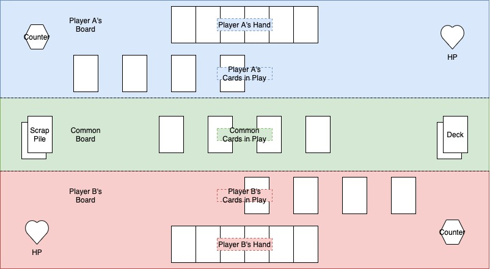

# CounterPlay Design Doc

## Synopsis

CounterPlay is a card game made with Unity and C#. It's a project by MrMusique88 and antoinePaulinB7, for the pursuit of fun...

## The Board

## How It Plays
Counter Play is a 2-player Card Game.

Each Player has an **HP Meter** and a **Counter**.

The Board is split into 3 zones. Player A's Board, the Common Board and Player B's Board.

The Board has a **Common Deck** as well as a **Scrap Pile**.

### Before the Game Starts

#### Building the Deck
Before the game, both players choose 20 (20 for now) cards that will be part of the **Common Deck**. They don't show those cards until both players have finished selecting their respective twenty cards.

Once both players have finished selecting their cards, the 40 (20 + 20) cards are put inside the **Common Deck**. Then, the **Common Deck** is shuffled.

#### Starting Numbers
Each player starts with 40**HP**.

Each player's **Counter** starts at 0.

Each player starts with 0 **cards** on their board or in their hand unless otherwise specified.

#### Picking a Starting Player
The worst player starts. Have fun arguing that. (In terms of computer thingies, the player with the most losses starts.)

If no agreement has been found, then one player is randomly picked to start.

### The Chronology of a Turn
1. The cards on the **Common Board** with a **beginning of turn effect** (B.O.T.) have these effects applied.
2. The cards on the **Current Player's Board** with a **beginning of turn effect** (B.O.T.) have these effects applied.
3. The **Current Player** draws 5 cards (+/- any depending on the effects in play) from the top of the **Common Deck** and places them in his or her **Hand**.
4. The **Current Player** plays any number of cards he so wishes (*See Playing a Card* for more information).
5. The cards on the **Current Player's Board** with a **end of turn effect** (E.O.T.) have these effects applied.
6. The **Current Player** places back any uplayed card from his or her **Hand** at the bottom of the **Common Deck**.
7. The difference on the **Current Player's Counter** is dealt as damage to his or her **HP**, unless otherwise specified. Then the **Current Player's Counter** is reset to 0. Unless otherwise specified.
8. The cards on the **Common Board** with a **end of turn effect** (E.O.T.) have these effects applied.
9. The **Other Player** becomes the **Current Player**. And a new turn begins.

### Playing a Card
Each card has a Cost.

Each card has a Type. (Player, Board, Both or None)

Each card has at least one Effect.

Playing a card applies its Cost to the **Current Player's Counter**. Adds the number for a positive cost, subtracts the number for a negative cost.

If the Card has momentary Effects, those Effects are applied, then the card is placed somewhere on the Board, depending on its type and the **Current Player**'s decision.
  * A Player type card can only be placed on a **Player Board**.
  * A Board type card can only be placed on the **Common Board**.
  * A None type card is placed on top of the **Scrap Pile** after its effects have been applied played.
  
### The Board
* 2 Players
* 1 Deck
* 1 Scrap Pile
* 0..x Cards in play (on **Common Board**)

### Player
* HP
* Counter
* Card Hand
* Cards in play (on **Player Board**)

### Deck
* 0..40 Cards
* Cards are Hidden

### Scrap Pile
* 0..40 Cards
* Cards are visible to all

### Card
* Cost
* Type
* Effects

### Effects
* Timing:
  * B.O.T.
  * E.O.T.
  * Momentary
#### Simple
* Heal, Damage, Draw, Peek, etc.

#### Win Condition
* A condition that if met, ends the game and determines the winner.
